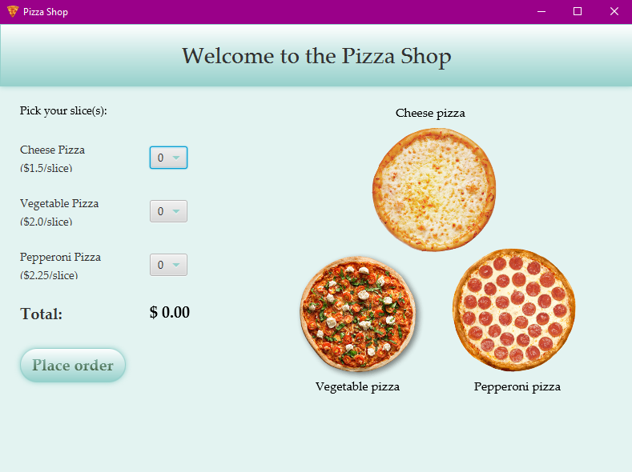
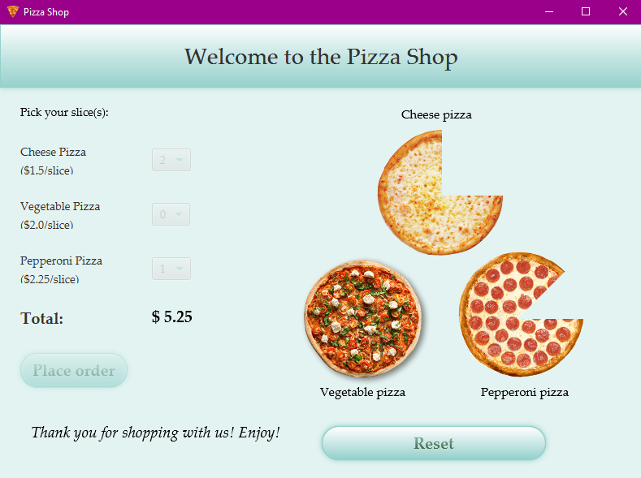

# Pizza Shop

Pizza Shop is a JavaFX program that allows you to choose between three different pizzas (cheese, vegetable, and pepperoni).
The customer can choose the number of slices and the total cost and slices of pizza removed will be displayed.

## Before placing order:

## After placing order:

